# Informe Tarea N°2
**Integrantes:**

Christian Bonifaz, Mateo Calderon, Josue Camacho, Luis Guevara

**NRC:** 5415

**Docente:** Ing. Darwin Alulema

**Tema:** Capitulo 3 (Resistencia) y capitulo 4 (Ley de Ohm, potencia y energía) de Análisis de Circuitos - Robbins, Miller

### 1. OBJETIVOS
- Emplear la teoria de resistencias,ley de Ohm, potencia y energía para la resolucion de ejercicios de circuitos eléctricos.

- Conocer y analizar las ideas y conceptos básicos sobre las resistencias y como se calculan, así como también sobre Ley de Ohm, potencia y energía.

### 2. MARCO TEÓRICO

#### Capitulo 3 (Resistencia)

#### Capitulo 4 (Ley de Ohm, potencia y energía

### 3. EXPLICACIÓN Y RESOLUCIÓN DE EJERCICIOS O PROBLEMAS

#### Capitulo 3 (Resistencia)

2. Determine la resistencia, a 20ºC, de 200 pies de conductores de hierro que tienen las siguientes secciones transversales:

4. El alambre de nicromo se usa para construir elementos calefactores. Determine la longitud de un alambre de nicromo de 1.0 mm de diámetro que se necesita para producir un elemento calefactor que tenga una resistencia de 2.0 ohm a una temperatura de 20°C.

6. Una pieza de alambre de aluminio tiene una resistencia, a 20°C, de 20 Ω. Si este alambre se funde y se usa para producir un segundo alambre que tiene una longitud cuatro veces más grande que la original, ¿cuál será la resistencia del nuevo alambre a 20°C? (Sugerencia: el volumen del alambre no ha cambiado.)

8. Un alambre sólido circular de 200 m de longitud y con un diámetro de 0.4 mm tiene una resistencia de 357 Ω  a 20°C. ¿De qué material está hecho el alambre?
Está hecho de PLOMO

10.  Una sección de alambre de hierro con un diámetro de 0.030 pulgadas tiene una resistencia de 2 500 Ω (a una temperatura de 20°C).
a. Determine el área de la sección transversal en metros cuadrados y en milímetros cuadrados. (Nota: una pulgada = 2.54 cm = 25.4 mm)

12. Use la tabla 3-2 para encontrar la resistencia de 250 m de conductores de cobre sólido AWG 8 y AWG 2. Compare los diámetros y resistencias de los alambres.

AWG 8: Diámetro de 0.1285 pulgadas. Resistencia 0.6281 

AWG 2: Diámetro de 0.2575 pulgadas. Resistencia 0.1563 

14. Si el AWG 8 se especifica para un máximo de 40 A, ¿cuánta corriente podrá conducir con seguridad el AWG 2?

Ya que el alambre AWG 8 es 6 veces menor que AWG 2, el cable de diámetro menor será capaz de conducir cerca de una sexto de la capacidad del cable de diámetro mas grande. 

AWG 8: Será capaz de conducir 6.6 A de corriente.

AWG 2: Será capaz de conducir 40 A  

16. ¿Cuánta corriente será capaz de conducir un alambre de cobre AWG 36?

La capacidad de corriente se duplica por cada incremento de tres calibres, y se reduce de igual forma, el AWG 36 será capaz de conducir 2 A. 

18. Exprese las áreas de las secciones transversales de los conductores del problema 17 en milésimas y milímetros cuadrados.

1 milésima cuadrada =4/π MC

a.- 265 MC = 208 milésimas cuadradas = 134 .19 milímetros cuadrados.

b.- 6200 MC = 4869 milésimas cuadradas = 3141.3 milímetros cuadrados.

c.- 1910 MC = 1500 milésimas cuadradas = 967.7 milímetros cuadrados.

20. Determine el diámetro en pulgadas y en milímetros de cables circulares que tiene las siguientes áreas se secciones transversales (suponga que los cables son conductores sólidos):

a.- 250 MC = 15.8 milésimas = 0.0158 pulgadas = 0.40132 milímetros 

b.- 1000 MC = 31. 63 milésimas = 0.0316 pulgadas= 0.80264 milímetros

c.- 250 MMC = 250 000 MC = 500 milésimas = 0.5 pulgadas= 12.7 milímetros

d.- 750 MMC = 750 000 MC= 866 milésimas= 0.866 pulgadas= 21.9 milímetros

22. Repita el problema 21 si el alambre está hecho de nicromo.

Un alambre de nicromo sólido de 200 pies tiene una resistencia de 0.500 ohm. 

a.	Determine el área de sección transversal del alambre en milésimas cuadradas y milésimas circulares. 

b.	Determine el diámetro del alambre en milésimas y en pulgadas.

d= 11.53 milésimas =0.011pulgadas 

26. Se diseña un alambre para uso doméstico de cobre sólido AWG 14 para operar dentro de un intervalo de temperatura de -40°C a 90°C. Calcule la resistencia de 200 pies de circuito de alambre a ambas temperaturas. Nota: un pie de circuito es la longitud del cable necesario para que la corriente viaje hacia una carga y de regreso.

28. Cierto material tiene una resistencia de 100 Ω a temperatura ambiente (20°C) y de 150 Ω a -25°C. 

a.- ¿El material tiene un coeficiente de temperatura positivo o negativo? Explique brevemente. 

Un incremento en la temperatura resulta en una disminución de la resistencia y, en consecuencia, estos materiales tienen coeficientes de temperatura negativos.

b.- Determine al valor del coeficiente de temperatura, a, a 20°C. 

34. Se mide la resistencia entre la terminal b del contacto deslizante y la terminal inferior c de un resistor variable de 200 kΩ y da 50 kΩ. Determine la resistencia que se medirá entre la terminal superior a, y la terminal del contacto deslizante b.

36. Determine los códigos de colores requeridos si necesitara los siguientes resistores para un proyecto: 

a.- 33 kΩ ± 5%, 0.1% de confiabilidad

Naranja-Naranja-Negro-Oro-Rojo

b.- 820 Ω ± 10% 

Gris-Rojo-Café-Plata

c.- 15 Ω ± 20% 

Café-Verde-Negro-Sin color

d.- 2.7 MΩ ± 5 %

Rojo-Violeta-Violeta-Oro

42. Para la fotocelda que tiene las características que se muestra en la figura 3-24(c), determine la resistencia 

a.-	en un sótano con iluminación atenuada de 10 lux 

R= 20kΩ

b.-	en una casa con una iluminación de 50 lux 

R=5.02kΩ

c.-	en un salón de clases con una iluminación de 500 lux

R=550 Ω

44. Determine la resistencia de los componentes que tienen las siguientes conductancias:

a.-  62.5 uS 
 

 
b.- 2 500 mS 

c.- 5.75 mS 

d.- 25.0 S

46. Determine la conductancia de una barra colectora de aluminio que mide 200 pies (a una temperatura de 20°C) la cual tiene una sección transversal que mide 4.0 pulgadas x 0.25 pulgadas. Si la temperatura aumentara, ¿qué pasaría con la conductancia de la barra?

#### Capitulo 4 (Ley de Ohm, potencia y energía)

**1. Para el circuito de la figura 4-33, determine la corriente I para cada uno de los siguientes incisos. Exprese la respuesta en la unidad más apropiada: amperes, miliamperes, microamperes, etcétera.**

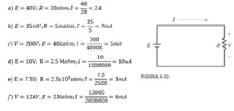

**2. Determine R para cada uno de los siguientes incisos. Exprese la respuesta en la unidad más apropiada: ohms, kilohms, megaohms, etcétera.**

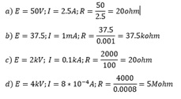

**3. Para el circuito de la figura 4-33, calcule V para cada uno de los siguientes incisos:**

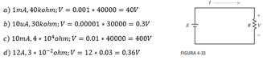

**4. Un calentador de agua de 48 ohm se conecta a una fuente de 120 V. ¿Cuál es la corriente que demanda?**

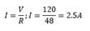

**5. Cuando se conecta una lámpara eléctrica a un contacto de pared de 120 V, requiere 1.25 A. ¿Cuál es su resistencia?**

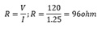

**6. ¿Cuál es la diferencia de potencial entre los extremos de un resistor de 20 ohm cuando su corriente es de 3x10^-3 A?**

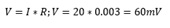

**7. ¿Cuánto voltaje se puede aplicar a un resistor de 560 ohm, si la corriente no debe exceder de 50 mA?**

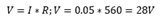

**8. Un relevador con una resistencia de la bobina de 240 ohm requiere un mínimo de 50 mA para operar. ¿Cuál es el mínimo voltaje para que funcione?**

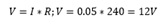

**9.	En la figura 4-33, si E=30 V y la conductancia del resistor es de 0.2 S, ¿cuál es el valor de I? Sugerencia: véase la sección 3-11 en el capítulo 3.**

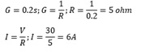

**10.	Si I=36 mA cuando E=12 V, ¿cuánto vale I si la fuente de 12 V es: a. reemplazada por una de 18 V? b. reemplazada por una de 4 V?**

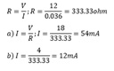

**11.	La corriente a través de un resistor es de 15 mA. Si la caída de voltaje en el resistor es de 33 V, ¿cuál es su código de colores?**

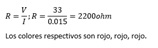

**12. En el circuito de la figura 4-34, a. Si E=28 V, ¿qué indica el medidor? b. Si E=312 V, ¿qué indica el medidor?**

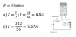

**13.	En el circuito de la figura 4-34, si el resistor es reemplazado por otro con bandas roja, roja y negra, ¿a qué voltaje cree que se funda el fusible?**

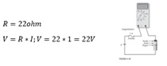

**14.	Una fuente de voltaje de 20 V se aplica a un resistor con bandas café, negra, roja y plata a. Calcule la corriente nominal en el circuito. b. Calcule las corrientes mínima y máxima con base en la tolerancia del resistor**

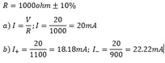

**15.	Un electroimán se devana con alambre de cobre AWG 30. La bobina tiene 800 vueltas y la longitud promedio de cada una es de 3 pulgadas. Cuando se conecta a una fuente de cd de 48 V ¿cuál es la corriente a. a 20°C? b. a 40°C?**

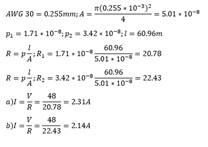

**16.	Se construirá un electroimán con alambre de cobre con 0.643 mm de diámetro. Para crear el campo magnético requerido, la corriente en la bobina debe de ser 1.75 A a 20˚C. El electroimán será alimentado por una fuente de 9.6 V. ¿Cuántos metros de alambre se necesitan para hacer la bobina?**

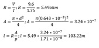

**17.	Un elemento resistivo está hecho de 100 m de alambre de aluminio con un diámetro de 0.5 mm. Si la corriente a 20˚C es de 200 mA ¿cuál es el voltaje aplicado?**

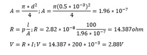

**18.	Haga una gráfica de la ley de Ohm similar a la de la figura 4-7 para un resistor de 2.5 kohm y uno de 5 kohm. Calcule y trace los puntos cada 5 V desde que E=0 V hasta 25 V. Lea los valores de la gráfica, para encontrar la corriente cuando E=14 V.**

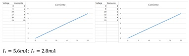

**19.	La figura 4-35 representa la gráfica I-V para el circuito de la figura 4-33. ¿Cuál es el valor de R?**

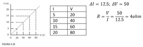

**20. En un circuito resistivo, E se cuadruplica y R se reduce a la mitad. Si la nueva corriente es de 24 A, ¿cuál era el valor de la corriente original?**

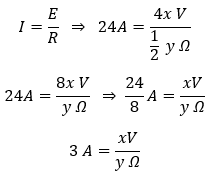

R= El valor de la corriente original es de 3 A.

**21. En un circuito resistivo, E = 100 V. Si R se duplica y E se cambia para que la nueva corriente sea el doble que la corriente original, ¿cuál es el nuevo valor de E?**

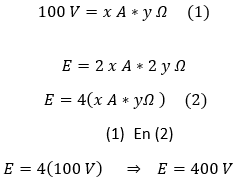

**22. Se necesita medir la resistencia de un elemento calentador eléctrico, pero sólo se tiene una batería de 12 V y un amperímetro. Describa cómo determinaría su resistencia. Incluya un bosquejo.**

Aplico la ley de Ohm ya que poseo la medida del voltaje de la batería y con el amperímetro conectándolo en serie obtengo la medida de la corriente y mediante la formula R=V/I determino medida de la resistencia de un elemento del calentador eléctrico.

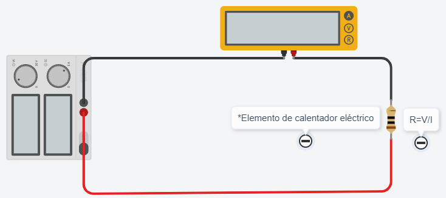

**23. Si 25 m de alambre de nicromo con un diámetro de 0.1 mm se conectan a una batería de 12 V, ¿cuál es la corriente a 20˚C?**

Resistencia de nicromo de 0.1mm a 20°c es = 132.4 Ω/m

Resistencia de alambre = 132.4 Ω/m * 25m = 3310 Ω

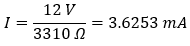

**24. Si la corriente es de 0.5 A cuando un tramo de alambre de cobre AWG 40 se conecta a 48 V, ¿Cuál es la longitud del alambre en metros? Suponga que la temperatura es de 20˚C.**

Resistencia de alambre de cobre AWG 40 a 20°c es = 3.543 Ω/m

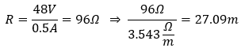

**25. Para cada resistor de la figura 4-36, determine el voltaje V y su polaridad o la corriente I, así como su dirección cuando sea posible.**

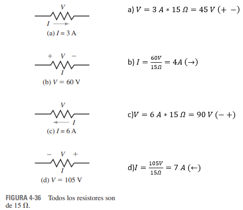

**26. Los amperímetros de la figura 4-37 tienen auto polaridad. Determine sus lecturas, magnitudes y polaridad.**

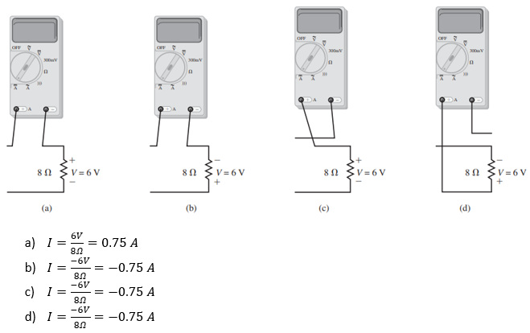

**27. Un resistor disipa 723 joules de energía en 3 minutos y 47 segundos. Calcule la tasa a la cual la energía se transfiere a este resistor en joules por segundo. ¿Cuál es la energía disipada en watts?**

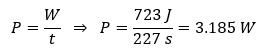

**28. ¿Cuánto tarda un cautín de 100 W en disipar 1470 J?**

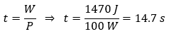

**29. Un resistor obtiene 3 A de una batería de 12 V. ¿Cuánta potencia entrega la batería al resistor?**

P = 12 V * 3 A = 36 W

**30. Una cafetera de 120 V está especificada en 960 W. Determine su resistencia y especifique la corriente.**

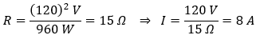

**31. Un calentador eléctrico de 1.2 kW tiene una resistencia de 6 Ω. ¿Cuánta corriente requiere?**

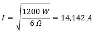

**32. Una lámpara de advertencia demanda 125 mA cuando disipa 15 W. ¿Cuál es su resistencia?**

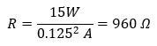

**33. ¿Cuántos volts se deben aplicar a un resistor de 3 Ω para que resulte una disipación de potencia de 752 W?**

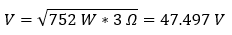

**34. ¿Qué reducción de IR ocurre cuando se disipan 90 W en un resistor de 10 Ω?**

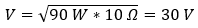

**35. Un resistor con bandas café, negro y naranja disipa 0.25 W. Calcule su voltaje y su corriente.**

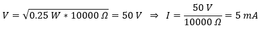

**36. Un resistor de 2.2 kΩ con una tolerancia de 5% se conecta a una fuente de cd de 12 V. ¿Cuál es el posible intervalo de potencia que disipa el resistor?**

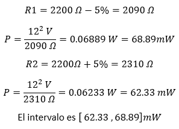

**37. Un transmisor de radio portátil tiene una entrada de potencia de 0.455 kW. ¿Cuánta corriente obtendrá de una batería de 12 V?**

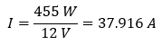

**38. En un circuito resistivo E 12V.**

a. Si la carga disipa 8 W ¿cuál es la corriente en el circuito? 

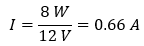

b. Si la carga disipa 36 W ¿cuál es la resistencia de la carga?

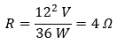

**39. Un motor entrega 3.56hp a una carga ¿Cuántos watts son?**

3.56 x 746= 2655.76W

**40. La carga en un circuito de 120 V consistente en seis lámparas de 100W, un calentador eléctrico de 1.2kW y un motor eléctrico de 1500W. Si el circuito se funde a 50A ¿Qué pasa si se conecta un tostador de 900W?. Explique su respuesta**

El circuito soporta 50A por lo que al conectar el tostador, se sobrecargaria el circuito a lo cual llevaría a que se fundiera.

**41. Un resistor de 0.27 kΩ es especificado en 2W. Calcule el máximo voltaje que se le puede aplicar y la máxima corriente que puede llevar sin exceder su especificación.**

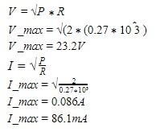

**42. Determinar cuál de los siguientes resistores pudo haber sido dañado por sobrecalentamiento. Explique su respuestas**

**A. 560Ω, ½ W con 75V a través de él**

P = (v^2)/R

P = 75^2/560

P=10.045 W

El valor nominal de la resistencia es (0.50)W a lo cual no es suficiente para manejar la potencia, la resistencia se ha dañado.

**B. 3Ω, 20W con 4A a través de él** 

P=I^2xR

P=(4)^2x(3)

P=48 W

El valor nominal de la resistencia es (20)W a lo cual no es suficiente para manejar la potencia, la resistencia se ha dañado.

**C. ¼ W con 0.25mA y 40 V a través de él**

0.25mA= 0.25/1000=(2.5x10^-4)A

P=VxI

P=40 x (2.5x10^-4)

P=0.01 W

El valor nominal de la resistencia es (0.25)W a lo cual es suficiente para manejar la potencia, la resistencia sigue sirviendo.

**43. Un resistor de 25Ω se conecta a un suministro de energía cuyo voltaje es de 100V ± 5% ¿Cuál es el posible intervalo de potencia disipada por el resistor?**

P= (v^2)/R

P1= (105)^2/25

P1=441 W

P2=(95)^2/25

P2=361 W

El posible intervalo de potencia es :361< P< 441

**44. Una carga de resistencia hecha de alambre de cobre se conecta a una fuente de cd de 24V. La potencia disipada por la carga cuando la temperatura del alambre es de 20 °C es de 192W. ¿Cuál será la potencia disipada cuando la temperatura del alambre disminuya a -10°C? (Suponga que el voltaje permanece constante).**

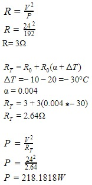

**45. Cada bloque de la figura 4-38 puede ser una fuente o una carga. Determine, para cada uno, su potencia y dirección.**

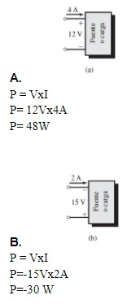

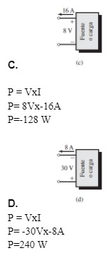

**46. La batería de 12V de la figura 4-39 está siendo “cargada” por un cargador. La corriente es de 4.5A como se indica.** 

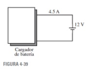

**A. ¿Cual es la dirección de la corriente?**

La dirección de la corriente es positiva osea hacia la derecha.

**B. ¿Cual es la dirección del flujo de potencia?**

La dirección de la Potencia es positiva osea hacia la derecha.

**C. ¿Cual es la potencia que llega a la batería?**

P = VxI

P= 12Vx4.5A

P=54W

**47.Una lámpara de seguridad nocturna de 40W se enciende por 9 horas.**

**A. Determine la energía usada en joules**

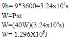

**B. Determine la energía usada en watts-hora**

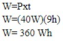

**C. A $0.08/kWh, ¿Cuánto cuesta encender esta lámpara por 9 horas?**

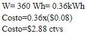

**48. Una lámpara indicadora en un papel de control opera de forma continua, requiere 20mA de un suministro de 120V. A $0.09 por kilowatt-hora ¿Cuánto cuesta al año el funcionamiento de esta lámpara?**

I=20mA=20/1000=0.02A

P=VxI

P=120V*0.02A

P=2.4W

W=Pxt

W=(2.4W)x(8760 h)

W= 21024 Wh

W= 21024 Wh=21.024kWh

Costo=(21.024kWh)(0.09kWh)

Costo=$189.216 ctvs

**49. Determine el costo total por usar los siguientes aparatos a $0.11 por kWh:**

**A. Un tostador de 900W por 5 minutos**

W=Pxt

W=(900w)(5/60)

75Wh=0.075kwh

Costo=(0.075kwh)($0.11kwh)

Costo= 0.825 ctvs

**B. Un calentador de 120V y 8A por 1.7 horas**

P=VxI

P=120Vx8A

P= 960 W

W=Pxt

W=(960W)x(1.7h)

W=1632 Wh

W=1632 Wh=1.632 kWh

Costo=(1.632 kWh)($0.11kwh)

Costo=0.1795ctvs

**C. Un lavaplatos de 1100W por 36 minutos**

W=Pxt

W=(1100W)(36/60)

660Wh=0.66kwh

Costo=(0.66kwh)($0.11kwh)

Costo=7.26 ctvs

**D.Un cautín de 120V y 288Ω por 24 minutos**

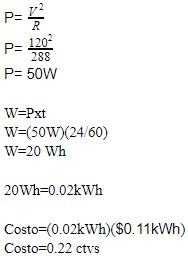

**50. Un dispositivo eléctrico con un ciclo de una hora opera a su máxima potencia 400W por 15 minutos, a potencia media por 30 minutos, luego se apaga por el resto de la hora. El ciclo se repite de manera continua. A $0.10/kWh, determine el costo anual para operar este dispositivo.**

W=(400)(15/60)+(200)(30/60)

W=200Wh=0.2kWh

Costo x hora=(0.2kWh)($0.10/kWh)

Costo x hora=$0.02 ctvs

costo x dia =$0.48 ctvs

costo x  año =$ 175.20 ctvs

**51. Mientras el dispositivo del problema 50 opera, otras dos cargas también lo
hacen:**

**A.Un calentador de 4 kW, de forma continua**

W2=(4kW)(8760h)

W2=35040 kWh

**B.Un calentador de 3.6 kW 12 horas al día.**

W3=(3.6kW)(24)=86.4(365)=31536kWh

Wtotal= 1752kWh +35040 kWh +31536kWh

W total= 68328 kWh

costo= 68328 kWh x 0.10 kWh

costo=$6832.8

**52. A $0.08 por kilowatt-hora, cuesta $1.20 operar un calentador por 50 horas con una fuente de 120 V. ¿Cuánta corriente demanda el calentador?**

costo= W x Costo por kilowatt-hora

$1.20 = W x $0.08 por kilowatt-hora

W= 120/0.08

W= 15 kWh

W=Pxt

P=W/t

P=15 kWh / 50h

P=0.3 kW

I=P/V

I= 0.3 kW/120 V

I=1/400 kA

I=2.5A

**53. Si hay 24 rebanadas en una barra de pan y se tiene un tostador de dos rebanadas de 1 100 W que tarda 1 minuto y 45 segundos en tostarlas, a $0.13/kWh ¿cuánto costaría tostar toda la barra?**

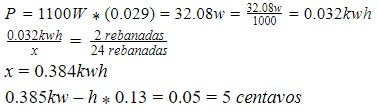

**54.La potencia de entrada de un motor con una eficiencia de 85% es de 690 W.¿Cuál es la potencia de salida?**

**A.en watts**

P.sal = P.ent * n

=690W*85%

=586.5W

**B.en hp**

690W = 0.92hp

=0.92hp*85%

=0.78hp

**55. La potencia de salida de un transformador con n=97% es de 50 kW.¿Cuál es la potencia de entrada?**

P.ent=P.sal/n

= 50kw/97%

= 51.5kw

**56. Para un dispositivo específico, n=94%. Si las pérdidas son de 18 W, ¿cuánto valen Pent y Psal?**

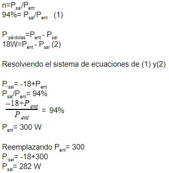

**57. La potencia de entrada de un dispositivo es de 1 100 W. Si la potencia que se pierde debido a varias ineficiencias es de 190 W, ¿cuál es la eficiencia del dispositivo?**

P.ent - P.perd = P.sal

1100W - 190W = 910W

n=P.sal/P.ent

=910W/1100W * 100

=82.7%

**58. Un calentador de agua de 240 V y 4.5 A produce una energía calorífica a razón de 3.6 MJ por hora. Calcule:**

**A. La eficiencia del calentador de agua.**

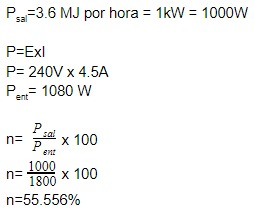

**B.El costo anual de operación a $0.09 kWh, si está encendido 6 horas al día.**

P=ExI

P= 240V x 4.5A

P=1080 W 

W=(1080 W)x(6h)

W= 6480 Wh

W=6480Wh= 6.48kWh

costo= (6.48kWh)($0.09 kWh)

costo= $0.5832 

**59. Un motor de cd de 120 V con una eficiencia de 89% demanda 15 A de una fuente. ¿Cuántos caballos de potencia tiene de salida?**

(120V)(15A) = 1800W

P.sal = P.ent x n 

= 1800W * 89%

= 1602W

= 2.15hp

**60. Un motor de cd de 120 V desarrolla una salida de 3.8 hp. Si su eficiencia es de 88%, ¿cuánta corriente demanda?**

**61. El sistema de potencia/control de un coche eléctrico se compone de un paquete de baterías incluido de 48 V, una unidad de control/manejo electrónica y el motor (figura 4-40). Si se requieren 180 A de las baterías ¿cuántos caballos de potencia se suministran a la tracción del vehículo?**

(48V)(180A) = 8640W

nt=(0.95)(0.80) = 76%

P.sal = P.ent * nt

= 8640W * 76%

= 6566.4W

= 8.8hp

**62.Demuestre que la eficiencia de n dispositivos o sistemas en cascada es el producto de sus eficiencias individuales, es decir, que nT=n1 x n2 x … x nn**

Para los sistemas con subsistemas y componentes en cascada (figura 4-23), la eficiencia total es el producto de las eficiencias de cada parte individual, donde las eficiencias se expresan en forma decimal. nt = n1*n2*...nn.

Para cierto sistema, n₁= 95%, n₂= 85% y n₃= 75% ¿Cuánto vale nt?

Si nt= 65%, n₂= 80% y n₃= 90% ¿Cuanto vale n₁?

Se convierten todas las eficiencias a un valor decimal y entonces se multiplican. Por lo que, nt= n₁n₂n₃= 

(0.95)(0.85)(0.75) 0.61 o 61%

 n₁= nt//n₂n₃)=  (0.65) (0.80  0.90) 0.903 o 90.3% 

**63. Un motor de cd de 120 V opera una bomba a través de una caja de engranes (figura 4-24). Si la potencia de entrada a la bomba es de 1100 W, la caja de engranes tiene una eficiencia de 75% y la potencia de entrada al motor es de 1600 W, determine los caballos de potencia de salida del motor.**

P.ent= 1100 * 100 / 75 = 1466.67W

P.sal = 1466.67 * 1hp/ 745.9 

= 1.97hp

**64. Si el motor del problema 63 se protege con un interruptor automático de 15 A, ¿se abrirá? Calcule la corriente para verificarlo.**

I = 1600W/120A

= 13.33A

No se abre ya que es menor a 15A

**65. Si la eficiencia total de una estación radio transmisora es de 55% y transmite a 35 kW por 24 h/día, calcule el costo de energía que usa cada día a $0.09/kWh.**

w = 35kw * 24h =840kwh / 55% = 1527.27kwh

1527.27kwh * $0.09 

$137.45

**66. En una fábrica hay dos máquinas que entregan cada una 27 kW, se usan promedio de 8.7 h/día, 320 días/año. Si la eficiencia de la máquina más nueva es de 87% y la de la máquina vieja es de 72%, calcule la diferencia en costo por año de operación a $0.10 por kilowatt-hora.**

W=27kW x 8.7 h = 234.9 kWh*320 dias =75168 kWh

Psal1= 75168 kWh x 87%=65396.16 kWh

Psal2=75168 kWh x 72% = 54120.96  kWh 

Costo 1 = (65396.16 kWh) x ($0.10 por kilowatt-hora)

Costo 1 =$ 6539.616

Costo 2 = (54120.96  kWh) x ($0.10 por kilowatt-hora)

Costo 2 =$5412.096

$ 6539.616 - $5412.096 =$1127.52

**67. Un resistor que depende del voltaje tiene la característica I-V de la figura 4-41.**

**A. En V=25 V, ¿cuánto valen I y Rcd?**

I=2.5(A)

25V/2.5I = 10

Rcd = 10Ω

**B. En V=60 V, ¿cuánto valen I yRcd?**

I=4.5(A)

60V/4.5I = 13.3

Rcd = 13.3Ω

**C. ¿Por qué los dos valores son diferentes?**

Porque se hizo el cálculo con el resistor no lineal, para que salga de igual manera deberá hacerse los cálculos con el resistor lineal 

**68. Para el resistor de la figura 4-41:**

**A.Determine Rdinámica para V entre 0 y 40 V.**

R= 4-0 /40-0 = 4A / 40V

R= 0.5Ω

**B.Determine Rdinámica para V mayor que 40 V.**

R= 5-4 / 80-40 = 1A / 20V

R= 0.05Ω

**C.Si V cambia de 20 a 30 V, ¿cuánto cambia I?**

La intensidad cambia en 1 A

**D.Si V cambia de 50 a 70 V, ¿cuánto cambia I?**

0.875-0.25

= 0.625A

**69. Establezca el circuito de la figura 4-33 y resuelva para las corrientes dado el par voltaje/resistencia del problema 1a, 1c, 1d y 1e.**

**70. Un cargador de batería con un voltaje de 12.9 V se usa para cargar una batería, véase la figura 4-42(a). La resistencia interna del cargador es 0.12 Ω y el voltaje de la batería, parcialmente desgastada, es 11.6 V. El circuito equivalente para la combinación cargador/batería se muestra en (b). Usted razona que como los dos voltajes están en oposición, el voltaje neto para el circuito será 12.9 V -11.6V = 1.3 V y por tanto la corriente de carga I será 1.3 V/0.12Ω = 10.8 A.Configure el circuito (b) y use Multisim para verificar su conclusión.**

**71. Haga clic en Coloca (Place) en la barra de menú; haga clic en Componente (Component); de la lista de Grupo (Group), seleccione Básico (Basic), desplácese hacia abajo y haga clic en Interruptor (Switch); seleccione SPDT, entonces haga clic en OK.Coloque en la pantalla y haga doble clic en su símbolo. Cuando la caja de diálogo se abra, seleccione la etiqueta Valor (Value), tecleé la letra A y haga clic en OK. [Esto reetiqueta el interruptor como (A). Presione la tecla A varias veces y observe que el interruptor abre y cierra.] Seleccione un segundo interruptor y etiquételo (B).Agregue una fuente de cd de 12 V y una lámpara. Para agregar la lámpara haga clic en Coloca/Componente (Place/Component) y a partir de la caja de Grupo (Group),seleccione Lámpara_virtual (Virtual_lamp). Arme el circuito de la figura 2-27, opere los interruptores y determine si consiguió exitosamente el control de dos vías**

### 4. VIDEO

[Problemas Capítulos 3 y 4 - Informe Tarea N°2](https://youtu.be/HFAaTkVXWOg "Problemas Capítulos 3 y 4 - Informe Tarea N°2")

### 5. CONCLUSIONES 

- Mediante el desarrollo de los ejercicios pudimos comprender más ampliamente los conceptos sobre la resistenia, así como también todos los elementos asociados a ella como el cálculo de las mismas, como se componen y cómo se miden.

- Se puede concluir que mediante el estudio de resistencias,ley de Ohm, potencia y energía se puede encontrar una gran variedad de ejercicios y con ello reforzar lo aprendido mediante clases.

### 6. BIBLIOGRAFÍA

Robbins, A., & Miller, W. (2008). Análisis de circuitos. Estados Unidos: Cengage Learning.
